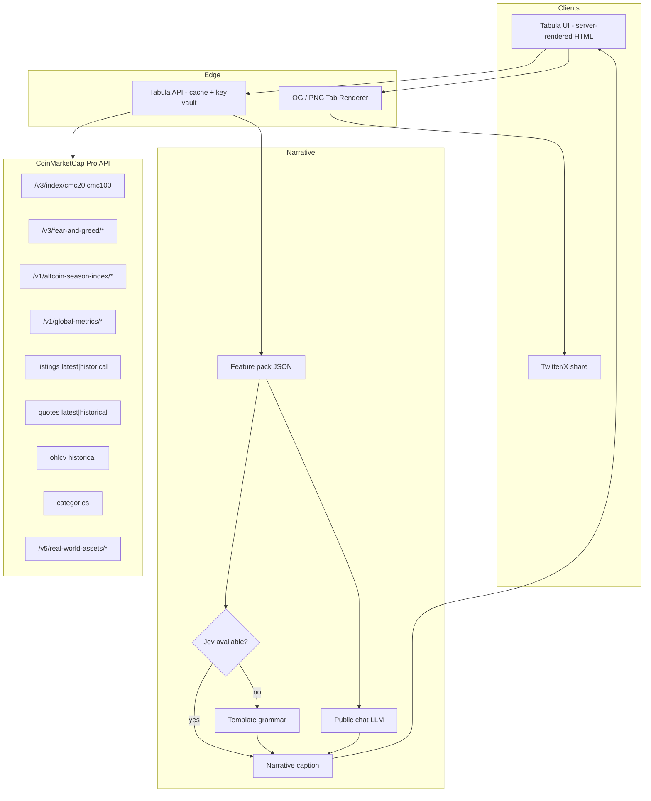
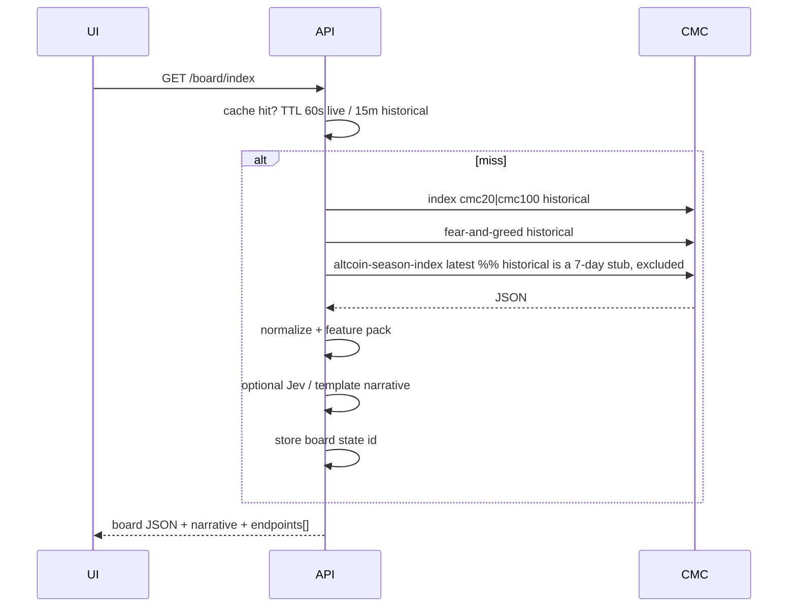
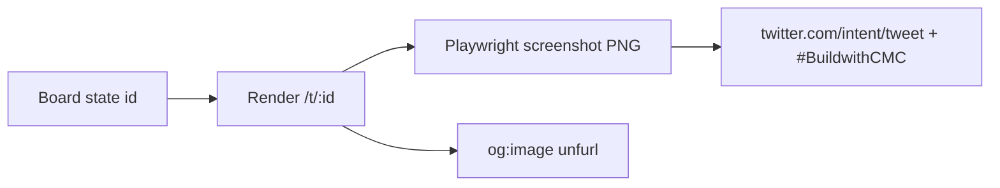

# Tabula — Architecture

## System overview



## Tabulae (data products)

| Tabula | Question | Primary series |
|--------|----------|----------------|
| **Regimen** | What regime is the basket in? | CMC20/100 hist, F&G, Global Metrics (Altcoin Season `historical` is a 7-day stub and is not a tape source) |
| **Rerum** | Who is *in* the market and how did membership change? | listings hist vs latest, categories, info |
| **Comparativa** | How do N *res* relate? | quotes hist, OHLCV, RWA quotes/issuers |

## Caching / credit discipline



## Share pipeline



## Repo layout (target — BUILT)

> **SUPERSEDED 2026-09-27.** The original layout below was
> specified as `tabula/apps/...` with Vite, React and ECharts. The runtime is now **Python 3.12
> stdlib** per `IN-5` and `TABULA-CONTRACT.md` §3, and the tree has been built inside
> `tabula-rerum/` at the paths below. The folder is the build root.

```text
tabula/
  apps/web/           # panels, classical type, wax-tablet chrome
  apps/api/           # CMC client, cache, board serializer, /t/:id
  packages/features/  # regime features, churn entropy, rebase math
  packages/narrative/ # template grammar + optional Jev client
  packages/share/     # PNG tab + intent URL
  evidence/           # live curl + response snippets for 7-pack
```

## Non-functional

- **No API keys in client** — all CMC calls server-side.
- **Named endpoints** on every panel footer + `/evidence` page.
- **Graceful degradation** — Jev/LLM optional; boards render without them.
- **Theme** — wax / bronze / papyrus; labels *REGIMEN*, *RERUM*, *COMPARATIVA*.

---

## 9. Jev workflow-builder adaptation (append — 2026-09)

> Full write-up: `jev-workflow-adaptation.md` · MVP plan: `mvp-from-jev-builder.md` · Research: `jev-workflow-ledger.md`  
> Upstream: `https://github.com/CTNicholas/jev-workflow-builder` cloned at `vendor/jev-workflow-builder/` (`main@9a652d2`, Apache-2.0).

### 9.1 Recommended path

**Extract patterns** (not full fork, not paint-only clone). Keep the executor + Jev gate + run-trace + mock fallbacks; drop multiplayer canvas / React Flow editor / fake users. Boards ship even if Liveblocks, Jev, and LLM keys are absent.

### 9.2 Board ↔ node roles

| Builder | Tabula |
|---------|--------|
| Input | Board brief (window, basket, assets) |
| *(new)* Fetch/Features | CMC series → rebase, spread, churn entropy |
| Jev (choice/score/noul) | Typed regime stamp + panel routing handles |
| LLM | Optional caption polish |
| Output properties | Share-card fields (`caption`, `regime_label`, `takeaway`, `endpoints[]`) |
| Feeds run messages | Evidence strip (mock/model/confidence) |

### 9.3 Jev-only vs rest

- **Jev only:** calibrated `choice`/`score`/`noul` labels, confidence-hedged copy, handle-fired panel emphasis, AND (`activation: all`) composite flags. Jev **cannot** write prose (VERIFIED).
- **Template always:** one-takeaway caption from feature pack.
- **LLM optional:** polish prose.

### 9.4 Compliance

Ship with `LICENSE` (Apache-2.0) + `NOTICE` crediting Chris Nicholas / Liveblocks examples + prominent notices on modified files. No API keys in git. See adaptation.md §7.

> **Note (2026-09-26).** Upstream ships **no `LICENSE` file and no `NOTICE` file** — only the
> `package.json` license field — so "keep the LICENSE" is not literally possible. Source the canonical
> Apache-2.0 text from <https://www.apache.org/licenses/LICENSE-2.0>. Apache-2.0 §4(d) NOTICE
> propagation is vacuous upstream because there is no NOTICE to propagate. The outer repository also
> ships no licence, so derived work currently sits unlicensed.

### 9.5 Cross-links

`concept.md` → `blueprint.md` → **`jev-workflow-adaptation.md`** → `mvp-from-jev-builder.md` → `stack-feasibility.md` · evidence: `jev-workflow-ledger.md` + `research-ledger.md` · APIs: `external-apis.md` + `build/api/openapi.cmc.json`.
