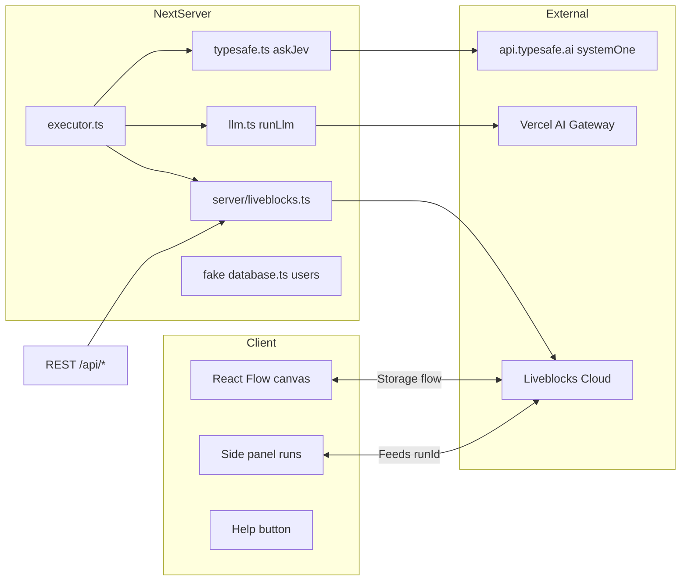
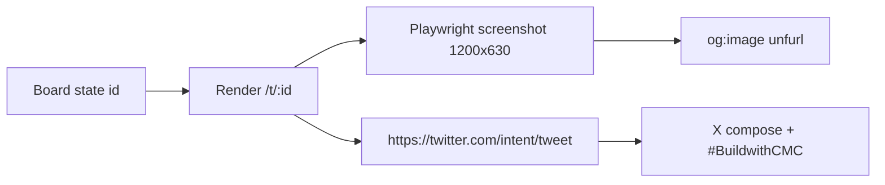

# Tabula · Jev Workflow Builder Adaptation Blueprint

**Source repo:** `https://github.com/CTNicholas/jev-workflow-builder`  
**Clone path:** `vendor/jev-workflow-builder/`  
**Clone status:** SUCCESS (shallow depth 50, `main` @ `9a652d2`)  
**License:** Apache-2.0 (`package.json` `"license": "Apache-2.0"`)  
**Target product:** Tabula (Data & Visualisation, Build with CMC)  
**Deadline:** 30 Sep 2026 23:59 UTC

Class marks: **VERIFIED** | **INFERRED** | **UNVERIFIED**

---

## 1. What the repo is

### 1.1 One-line

A multiplayer **AI workflow builder demo** by Chris Nicholas (Liveblocks DX) that wires **TypeSafe Jev** (typed Choice/Score/Noul gates) and **LLM nodes** (Vercel AI Gateway) into a **React Flow** canvas, with persistence + run traces in **Liveblocks Storage + Feeds**. VERIFIED from README + source.

### 1.2 Stack (VERIFIED from `package.json` + configs)

| Layer | Package / tech | Role |
|-------|----------------|------|
| App | Next.js 16 App Router, React 18, TypeScript | SSR + server actions + API routes |
| Canvas | `@xyflow/react` 12 (React Flow) | Node/edge graph editor |
| Multiplayer | `@liveblocks/*` 3.23 + `@liveblocks/react-flow` | Presence, Storage (flow), Feeds (runs) |
| Decisions | `@typesafe-ai/sdk` 0.6 | Jev `systemOne` — Choice / Score / Noul |
| LLM prose | `ai` 6 (Vercel AI SDK) | Streaming text via AI Gateway |
| Icons | `lucide-react` | Node chrome |
| IDs | `nanoid` | run / edge / question ids |
| CSS | Tailwind 4 + PostCSS | UI |

### 1.3 Maturity

| Signal | Observation | Class |
|--------|-------------|-------|
| Commits | 8 on `main` (first commit → README polish) | VERIFIED |
| Tests | **None** | VERIFIED |
| CI | **None** | VERIFIED |
| LICENSE file | **Missing at root** (license only in `package.json`) | VERIFIED |
| Error handling | Typed answers + mock fallbacks + `safe()` feed writes | VERIFIED |
| Demo readiness | Seeded support-triage workflow, mock modes without keys | VERIFIED |
| Production readiness | Demo grade — fake user DB, no auth productization, no rate limits on run trigger | INFERRED |

**Verdict:** polished **demo / pattern library**, not a product. Good extract surface; low product debt.

### 1.4 Architecture (as built)



### 1.5 File map (VERIFIED)

| Path | Role | Tabula fate |
|------|------|-------------|
| `app/workflow/shared.ts` | Node/edge types, handles, topo sort, templates | **Extract + extend** |
| `app/workflow/server/executor.ts` | Graph walk, activation any/all, node results | **Extract + extend** |
| `app/workflow/server/typesafe.ts` | `askJev` + keyless mock | **Extract** (keep mock) |
| `app/workflow/server/llm.ts` | `runLlm` + canned mock stream | **Extract** (optional) |
| `app/workflow/server/liveblocks.ts` | Rooms, `mutateFlow`, graph snapshot | **Replace or thin** |
| `app/workflow/runs.ts` | Run/Answer/NodeResult types | **Extract** |
| `app/workflow/demo.ts` | Support triage demo graph | **Replace** with Tabula demo |
| `app/workflow/nodes.tsx` | Input/Jev/LLM/Output node UIs | **Extract subset** |
| `app/workflow/editor.tsx` | React Flow + Liveblocks wiring | **Rewrite** (board-first) |
| `app/workflow/fields.tsx` | Form primitives | **Reuse** |
| `app/workflow/side-panel.tsx` | Run list / trace viewer | **Reuse** as evidence panel |
| `app/workflow/run-context.tsx` | Run trigger + streaming | **Simplify** |
| `app/workflow/actions.ts` | Server actions create/rename/list | **Adapt** |
| `app/workflow/workflow-app.tsx` | Shell | **Rewrite** as Tabula shell |
| `app/workflow/workflow-list.tsx` | List workflows | **Adapt** → board list |
| `app/database.ts` | Hardcoded demo users | **Drop** (or stub auth) |
| `app/api/**` | liveblocks-auth, users, runs REST | **Thin / replace** |
| `liveblocks.config.ts` | Presence + Feed typing | **Adapt** for board runs |
| `next.config.js`, `vercel.json` | Deploy | **Keep** |
| `.env.example` | 3 keys | **Extend** |

### 1.6 Persistence model (VERIFIED)

1. **Workflow graph** → Liveblocks Storage under key `flow` via `@liveblocks/react-flow` (`FLOW_STORAGE_KEY = "flow"`). Server reads a point-in-time snapshot with `mutateFlow(... flow.toJSON())`.
2. **Workflow list** → Liveblocks **rooms** filtered by metadata `{ app, workflowId, name }`. No SQL.
3. **Runs** → Liveblocks **Feeds**: one feed per `runId`, `FeedMetadata` = `{status, trigger, input, startedAt, completedAt?, error?}`, `FeedMessageData` = `NodeResultData` (one message per executed node; LLM chunks via `updateFeedMessage`).
4. **Users** → in-memory `app/database.ts` (Charlie Layne etc.). Not real auth.

---

## 2. Clone vs fork vs extract — recommended path

### 2.1 Options

| Path | What | Days to 30 Sep | Risk | Fit for Tabula |
|------|------|----------------|------|----------------|
| **A. Clone & restyle** | Run the demo as-is, paint wax/bronze, swap demo copy | 0.5–1 d | Low | **Poor** — still a support-triage workflow builder, not a market board |
| **B. Full fork** | Keep multiplayer canvas as the product; add CMC fetch nodes | 8–12 d | High (Liveblocks + auth + canvas UX) | Medium — fights the judging brief (boards ≠ workflow builders) |
| **C. Extract patterns (RECOMMENDED)** | Steal executor + Jev gate + run-trace + share; build **board-first** Tabula beside the demo | **4–6 d** | Low–Med | **Best** — ships Regimen/Rerum/Comparativa + optional typed narrative gates |
| **D. Extract only narrative** | Pure UI boards + template captions; no graph | 3–4 d | Lowest | Acceptable floor if Jev key unavailable |

### 2.2 Recommendation: **Extract patterns (C)**, with a thin optional workflow arm

**Why not full fork (B):** Tabula’s judging hinge is **non-obvious market boards** (regime geometry, rank churn, RWA-in-frame) and the **7-pack share**. A multiplayer workflow builder is a different product and would burn the 6-day budget on Liveblocks rooms, cursors, and graph UX — invisible to Data-Viz judges. VERIFIED from track brief language + local gallery thinness (research-ledger #28–36).

**Why extract (C):** The repo’s **highest-value IP for Tabula** is not the canvas — it is:

1. **Typed Jev gates** (`typesafe.ts` → Choice/Score/Noul → handle fan-out) — turns narrative into *discrete, confidence-scored regime labels*.
2. **Executor semantics** (`executor.ts`): topological walk, `any`/`all` activation, answer accumulation, handle-fired edges — reusable as a **feature-pack → label → caption** pipeline without drawing a graph UI.
3. **Run trace shape** (`runs.ts` + Feeds): one message per step with `mock`, `confidence`, `probabilities` — perfect **evidence strip** under each board.
4. **Mock fallbacks**: demo works with **zero AI keys** (keyword-overlap Jev + canned LLM). Critical for judges and CI.

**What to leave behind:** React Flow editor, Liveblocks multiplayer cursors, fake users, support-triage demo, room-per-workflow list.

**Hybrid stretch (optional, after boards ship):** a “Board Lab” page that *does* reuse the canvas to compose custom CMC fetch → Jev gate → caption workflows. Nice-to-have, not v1.

### 2.3 Decision matrix vs 30 Sep 2026

| Milestone | Extract path | Full fork path |
|-----------|--------------|----------------|
| Day 1–2 | CMC client + cache + feature pack | Canvas fork + Liveblocks keys |
| Day 3–4 | Regimen + Rerum boards | Fetch node + run REST |
| Day 5 | Comparativa + RWA island | First end-to-end run |
| Day 6 | Narrative gates + PNG tab + 7-pack | Partial narrative |
| Judges see | Classical boards + named endpoints + share | A workflow builder with crypto data |

**Recommendation lock:** Extract (C). Ship boards. Reuse executor/Jev/run-trace as libraries under `packages/`.

---

## 3. Tabula boards → workflow-builder nodes/edges map

The builder is a **text workflow**. Tabula is a **data workflow**. Map by *role*, not by pixel.

### 3.1 Role mapping (VERIFIED source roles)

| Workflow-builder concept | Tabula analogue | Notes |
|--------------------------|-----------------|-------|
| `Input` node (`sample` string) | **Board brief** (date range, basket, assets) | One board run = one input |
| **Fetch / Series node** (NEW — not in repo) | CMC series pull (index, F&G, listings…) | Replace LLM-first with data-first |
| `Jev` node (choice/score/noul questions) | **Regime / churn / divergence gates** | The Jev-only differentiator |
| `LLM` node (prose) | **Narrative caption** | Optional; template always available |
| `Output` node (named properties) | **Board fields** (`caption`, `regime_label`, `takeaway`, `endpoints[]`) | Maps to share card |
| Edges + handles (`q:qid:key`, `any`, `out`) | **Conditional panel emphasis** | e.g. `regime=risk_off` → highlight drawdown ribbon |
| `activation: any \| all` | **AND/OR composite flags** | e.g. `churn_high AND fg_greed` → caution strip |
| Feeds run messages | **Evidence / audit strip** | Show mock/real, confidence, model |
| `renderTemplate` `{{answers.x}}` | Caption fill-ins | Keep verbatim |

### 3.2 Board-specific graphs (logical; UI need not be a canvas)

#### Tabula Regimen

```text
Input(board_brief)
  → Fetch[cmc20_hist, cmc100_hist, fg_hist, asi_hist, global_hist]
  → Features[rebase100, spread, ribbon, dual_tape]
  → Jev(gates)
        choice  regime_shape   = breakout | compression | divergence | meltup | risk_off
        score   churn_stress   = calm | building | hot | chaotic
        noul    spread_extreme = is |cmc20-rebase − cmc100-rebase| beyond normal?
  → LLM? / Template(regime caption)
  → Output { caption, regime_label, takeaway, endpoints[], confidence[] }
```

#### Tabula Rerum

```text
Input(date_range)
  → Fetch[listings_hist, listings_latest, categories, map, info]
  → Features[membership bump, churn entropy H=-Σp log p, category treemap]
  → Jev(gates)
        choice  membership_regime = stable | rotating | purge | expansion
        score   churn_entropy     = low | mid | high | extreme
        noul    new_entrants_spike
  → Caption → Output
```

#### Tabula Comparativa

```text
Input(ids[2..4], window)
  → Fetch[quotes_hist, ohlcv_hist, perf_stats, rwa_quotes, rwa_issuers]
  → Features[aligned series, relative strength, RWA island]
  → Jev(gates)
        choice  relative_call = A_leads | B_leads | chop | decoupled
        noul    rwa_in_frame_meaningful
  → Caption → Output
```

**Implementation note:** These can be **hardcoded pipelines** in `packages/features` + `packages/narrative`. The canvas is optional. The executor’s `NodeState`/`firedHandles` model still applies if you want runtime branching.

### 3.3 Where the builder’s types land in Tabula

| Builder type | Field | Tabula use |
|--------------|-------|------------|
| `ChoiceQuestionDef` | `options[{key,description}]` | Regime / membership / relative labels |
| `ScoreQuestionDef` | `levels[{key,description}]` ordered | Churn stress, divergence intensity |
| `NoulQuestionDef` | `threshold` + yes/no handles | Extreme-spread gate, RWA-in-frame gate |
| `Answer` (choice/score/noul) | `confidence`, `probabilities` | Panel badge + narrative hedge |
| `WorkflowOutput` | `Record<string,string[]>` | Share-card fields |

---

## 4. Where CMC data enters (vs Arkham/Alchemy optional)

**Rule:** do not invent endpoints. All paths below are **VERIFIED** against `build/api/openapi.cmc.json` (114 paths).

### 4.1 Primary CMC spine (required for boards)

| Board | Endpoint (exact) | Role |
|-------|------------------|------|
| **Regimen** | `/v3/index/cmc20-latest`, `/v3/index/cmc20-historical` | Basket A |
| | `/v3/index/cmc100-latest`, `/v3/index/cmc100-historical` | Basket B |
| | `/v3/fear-and-greed/latest`, `/v3/fear-and-greed/historical` | Sentiment tape |
| | `/v1/altcoin-season-index/latest` (its `historical` is a 7-day stub and is excluded) | Breadth tape |
| | `/v1/global-metrics/quotes/latest`, `/v1/global-metrics/quotes/historical` | Dominance / macro |
| **Rerum** | `/v3/cryptocurrency/listings/latest` | Top-N now |
| | `/v1/cryptocurrency/listings/historical` | Top-N on date D (churn) |
| | `/v1/cryptocurrency/categories`, `/v1/cryptocurrency/map`, `/v2/cryptocurrency/info` | Category / identity |
| **Comparativa** | `/v3/cryptocurrency/quotes/latest`, `/v3/cryptocurrency/quotes/historical` | N-res quotes |
| | `/v2/cryptocurrency/ohlcv/historical` | Price path |
| | `/v2/cryptocurrency/price-performance-stats/latest` | ATH/ATL / ROI strip |
| | `/v5/real-world-assets/quotes/latest`, `/v5/real-world-assets/issuers/list`, `/v5/real-world-assets/issuers`, `/v5/real-world-assets/assets/list`, `/v5/real-world-assets/map`, `/v5/real-world-assets/info` | RWA island |

### 4.2 Optional enrichment (never block boards)

| Source | Use | Dependency |
|--------|-----|------------|
| **Arkham** `api.arkm.com` | Entity labels on whales / issuers, risk score strip | Optional key `ARKHAM_API_KEY`. OpenAPI + `llms.txt` **VERIFIED** |
| **Alchemy** `*.g.alchemy.com` | Wallet flows for RWA token contracts (`alchemy_getTokenBalances`, `alchemy_getAssetTransfers`) | Optional `ALCHEMY_API_KEY`. Enhanced APIs **VERIFIED** |
| CMC `/x402/*` | Pay-per-call demo of listings | Optional flourish |
| CMC `/v5/cmc-ai/*` | AI-tagged coins | Optional |

**Graceful degradation:** if Arkham/Alchemy keys absent → hide island chrome, keep CMC RWA series. Same pattern as Jev mock.

### 4.3 Cache / credit discipline

| Series | TTL | Why |
|--------|-----|-----|
| `*-latest`, listings latest | 60s | ~1 min CMC refresh (INFERRED from market standard) |
| `*-historical`, listings historical | 15m | Stable |
| Board JSON `/t/:id` | Immutable snapshot | Shareable, zero re-fetch |

All CMC calls **server-side only**. No keys in client. VERIFIED constraint from architecture.md + standard practice.

---

## 5. What is only possible with Jev vs public LLM prose vs pure UI

### 5.1 Capability split

| Capability | Pure UI / math | Public LLM prose | **Jev only** |
|------------|----------------|------------------|--------------|
| Rebase, spread, entropy, bump chart | ✅ deterministic | ❌ | ❌ |
| Pretty caption paragraph | Template slots | ✅ best | ❌ (cannot generate text) |
| **Typed regime label** with calibrated `probabilities` over a fixed set | ❌ heuristic only | ❌ (parse-fragile) | ✅ `choice` |
| **Ordered stress grade** with expected score + level distribution | ❌ | ❌ | ✅ `score` |
| **Calibrated yes/no gate** (`noul` 0–1) + threshold → handle | ❌ | ❌ | ✅ `noul` |
| **Confidence-hedged caption** (`"likely risk_off (p=0.72)"`) | ❌ | Fakeable, uncalibrated | ✅ real calibration |
| **Branching panels** on answer handles (`risk_off` edge fires drawdown ribbon) | Manual rules | ❌ | ✅ native |
| **AND gates** (`churn_hot` AND `fg_greed`) | DIY boolean | ❌ | ✅ `activation: all` |
| Non-hallucinatory classification of free text (user note, tweet reply) | ❌ | Can hallucinate | ✅ typed outputs only |
| 70–500ms multi-question batch | — | Seconds | ✅ VERIFIED latency class |

### 5.2 Jev-only product moments (sell these to judges)

1. **Regime stamp on every tab** — Choice over `{breakout, compression, divergence, meltup, risk_off}` with a probability bar. Not a vibe paragraph: a **typed, calibrated stamp**.
2. **Confidence-aware narrative** — if `confidence < 0.35`, template switches to “mixed signals” copy; LLM is instructed to hedge. Only Jev gives a usable `confidence`.
3. **Panel routing** — `score(churn_stress) >= hot` fires the “membership chaos” Rerum panel; `noul(spread_extreme)` fires the caution ribbon. Pure UI cannot emit those handles from language.
4. **Auditable evidence** — run trace shows `probabilities`, `mock`, `model`. Judges can see *why* the stamp said `risk_off`.
5. **Zero-hallucination labels** — TypeSafe: “gives up string generation… can’t hallucinate” (**VERIFIED** typesafe.ai blog). Market labels stay trustworthy even if the LLM caption is wrong.

### 5.3 What Jev cannot do (do not oversell)

| Limit | Consequence |
|-------|-------------|
| No string generation | Always pair with template or LLM for prose (**VERIFIED**) |
| Noul 0.5 = ignorance, not “medium” | Don’t map to 0–100 gauges naively (**VERIFIED** learnjev.com) |
| Score is ordinal, not metric | Don’t treat 1.6/2 as “80%” |
| Choice vs Noul disagree | Don’t assume complementarity; design questions carefully |
| Early access / key | Ship with mock; real key upgrades stamp quality |
| 64k state | Feed **feature pack JSON**, not raw OHLCV dumps |

### 5.4 Fallback ladder (ship all three)

```text
1. Template grammar  (always)     — feature pack → one takeaway
2. Jev gates         (if TYPESAFE_API_KEY) — typed stamp + handle routing
3. LLM caption       (if AI_GATEWAY_API_KEY or free chat) — polish prose
```

Builders’ existing mocks make step 2–3 safe without keys. VERIFIED `typesafe.ts` mockJev + `llm.ts` streamMockReply.

---

## 6. Twitter share of rendered boards (7-pack)

Hackathon requires an X post with `#BuildwithCMC` plus DoraHacks link (**VERIFIED** research-ledger #94, #20). Tabula’s **product share** is a *Tab* PNG + intent URL.

### 6.1 7-pack share payload (one board = one Tab)

| # | Pack element | Tabula implementation |
|---|--------------|----------------------|
| 1 | Product / demo URL | `https://…/t/:boardId` |
| 2 | Repo URL | GitHub (this monorepo) |
| 3 | Short demo video | 30–60s screen recording |
| 4 | Named CMC endpoints | On card footer + `/evidence` |
| 5 | Live evidence (curl/JSON) | `/evidence` page + run strip |
| 6 | X post | Intent button prefill |
| 7 | Where API got in the way | Submission note (no RWA historical, etc.) |

### 6.2 Share pipeline (maps builder’s run-trace → static Tab)



- **Render:** server snapshot of board (already how Feeds freeze runs).  
- **PNG:** Playwright full-page 1200×630 (or `@vercel/og` Satori if speed matters).  
- **Intent URL (VERIFIED X docs):**  
  `https://twitter.com/intent/tweet?text=…&url=…&hashtags=BuildwithCMC&via=…`  
  Parameters: `text`, `url`, `hashtags`, `via`, `related`.  
- **Card meta:** `summary_large_image`, `og:image` per Tab id so unfurls work without JS.

### 6.3 Default tweet text (template, then optional LLM polish)

```text
Tabula · REGIMEN {date}
{regime_label} (p={prob}, conf={conf})
{one_takeaway}
—
{cmc20_vs_cmc100_spread} · F&G {fg} · ASI {asi}
#BuildwithCMC
{demo_url}
```

---

## 7. License / compliance if shipping derived work

| Item | Status | Class |
|------|--------|-------|
| Upstream license | Apache-2.0 in `package.json` | VERIFIED |
| Root `LICENSE` file | **Absent** in clone | VERIFIED |
| NOTICE file | Absent | VERIFIED |
| Copyright holder | Chris Nicholas / Liveblocks (author context) | VERIFIED identity |

### 7.1 Apache-2.0 obligations (VERIFIED license text)

If you **distribute** a Derivative Work (source or object):

1. **Include a copy of the Apache-2.0 License** with the distribution.  
2. **Cause modified files to carry prominent notices** that You changed them.  
3. **Retain** all copyright, patent, trademark, and attribution notices from the original Source form (excluding irrelevant ones).  
4. **If a NOTICE file exists** upstream, include its attribution notices in your Derivative (NOTICE / docs / UI). Upstream has **no NOTICE** today — still wise to add one crediting the demo.  
5. **Trademarks** are not licensed — don’t imply Liveblocks/TypeSafe endorsement.  
6. **Patent grant** is defensive (terminates if you sue over the Work).

You **may** add your own copyright and additional terms on *your modifications* as a whole, provided Apache-2.0 conditions on the original are met. Commercial use is allowed.

### 7.2 Practical Tabula compliance checklist

```text
[ ] Keep LICENSE (Apache-2.0) at repo root of any published fork/extract
[ ] NOTICE:
      Includes patterns from jev-workflow-builder
      Copyright 2026 Chris Nicholas / Liveblocks examples
      Licensed under Apache-2.0
[ ] Mark modified files (header comment or CHANGELOG section “Changes vs upstream”)
[ ] Do not use Liveblocks / TypeSafe / CoinMarketCap logos without their brand rules
[ ] No API keys in git (add .env* to .gitignore — upstream already has .gitignore)
[ ] CMC data attribution as required by CMC API terms (separate from Apache)
```

### 7.3 Extract-only note

Clean-room **patterns** (topo sort, handle ids, mock Jev) implemented fresh in `packages/` with only light quoting of Apache-2.0 code **still** should credit upstream. Cheapest safe path: **fork, keep LICENSE + NOTICE + change markers**. Recommended.

### 7.4 Third-party licenses to carry

| Dep | License (typical) | Note |
|-----|-------------------|------|
| Liveblocks SDK | Commercial ToS | Not OSS — you need a Liveblocks account |
| TypeSafe SDK | Check npm | Early-access ToS |
| xyflow/react | MIT | Keep copyright |
| ai (Vercel) | Apache-2.0 | Keep notice |
| Next.js | MIT | Keep |

**UNVERIFIED:** exact license files of `@typesafe-ai/sdk` and Liveblocks commercial terms — read before shipping binary.

---

## 8. Cross-links

| Doc | Purpose |
|-----|---------|
| `blueprint.md` | Product modules + endpoint list |
| `concept.md` | Problem + judging map |
| `architecture.md` | System diagrams + target layout (see new §9) |
| `mvp-from-jev-builder.md` | Minimal fork/extract plan + env + judge demo |
| `jev-workflow-ledger.md` | Research call log (210+) |
| `research-ledger.md` | Prior Tabula research (213 calls, credited) |
| `external-apis.md` | Arkham/Alchemy status |
| `stack-feasibility.md` | 6-day plan |
