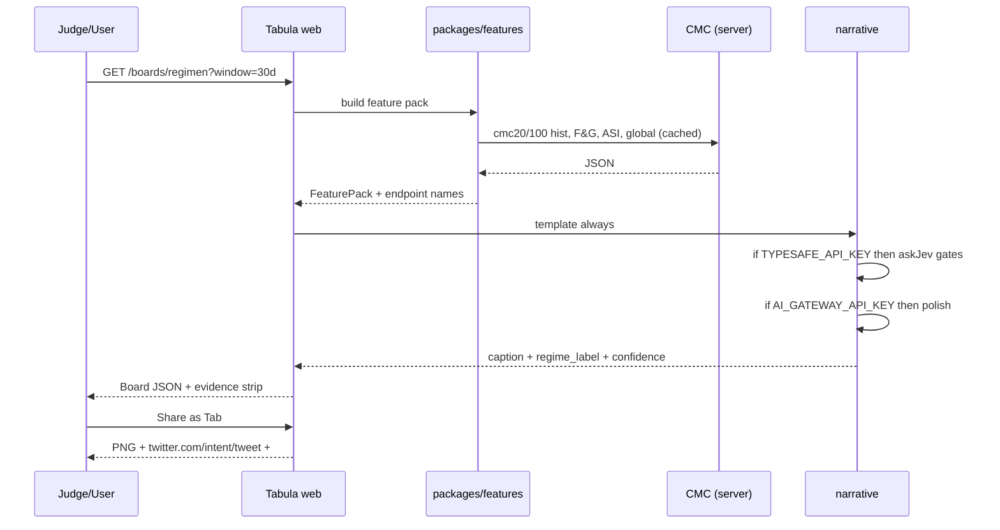

# Tabula MVP — Minimal Plan from jev-workflow-builder

**Goal:** Ship a judge-ready Data-Viz product by **30 Sep 2026 23:59 UTC** using patterns from `vendor/jev-workflow-builder` (Apache-2.0).  
**Path:** Extract patterns (see `jev-workflow-adaptation.md` §2) — board-first, not multiplayer canvas.  
**Floor:** works with **zero AI keys** (template narrative). **Ceiling:** Jev stamps + LLM captions + PNG Tab share.

---

## 1. Keep / change / drop

### 1.1 Keep almost as-is (copy into `packages/` or `apps/web/src/legacy/`)

| File | Why |
|------|-----|
| `app/workflow/shared.ts` | Handles, topo sort, `renderTemplate`, slugify, factories — pure functions |
| `app/workflow/runs.ts` | `Answer`, `NodeResultData`, `RunTrace`, limits |
| `app/workflow/server/typesafe.ts` | `askJev` + `mockJev` (keyword overlap) — the Jev adapter |
| `app/workflow/server/llm.ts` | `runLlm` + `streamMockReply` |
| `app/workflow/fields.tsx` | Form primitives |
| `app/workflow/server/executor.ts` | **Extract core loop** even if you don’t render a graph |

### 1.2 Change (surgical edits)

| File | Change |
|------|--------|
| `app/workflow/demo.ts` | Replace support triage with **Tabula demo graph** (Regimen gates) |
| `app/workflow/shared.ts` | Add `FetchNode` / `BoardNode` types OR bypass nodes and call `packages/narrative` directly |
| `app/workflow/server/executor.ts` | Accept a **feature pack** state (numbers + series snippets), not only free text |
| `liveblocks.config.ts` | `FeedMetadata` for board runs; drop `selectedRunId` if single-player |
| `.env.example` | Add CMC + optional Arkham/Alchemy (names only) |
| `package.json` | Rename `tabula`, keep the `Apache-2.0` license field, add `NOTICE` |

### 1.3 Drop / defer

| Item | Reason |
|------|--------|
| React Flow editor UX (`editor.tsx`, `nodes.tsx` bulk) | Not the product for Data-Viz track |
| `@liveblocks/react-flow` multiplayer cursors | Demo polish, not judging hinge |
| `app/database.ts` fake users | Stub one anonymous user |
| `app/api/users/**` | Not needed |
| Full workflow list UI | Replace with board list |

### 1.4 New files (small)

```text
apps/web/
  app/t/[boardId]/page.tsx     # shareable board snapshot
  app/evidence/page.tsx        # curl + JSON for 7-pack
  app/boards/regimen.tsx       # Tabula Regimen
  app/boards/rerum.tsx         # Tabula Rerum
  app/boards/comparativa.tsx   # Tabula Comparativa
  app/share/intent.ts          # Twitter intent URL
packages/
  cmc/client.ts                # server-only CMC + cache
  features/regimen.ts          # rebase, spread, dual tape
  features/rerum.ts            # churn entropy, membership
  features/comparativa.ts      # N-res + RWA island
  narrative/template.ts        # always-on caption grammar
  narrative/jev-gates.ts       # Choice/Score/Noul defs + routing
  narrative/llm-caption.ts     # optional polish
  share/render-png.ts          # Playwright / Satori
```

---

## 2. Env vars (names only — **no secrets in git**)

```bash
# --- required for live CMC boards ---
CMC_API_KEY=                 # CoinMarketCap Pro API (server-only)
# optional keyless trial subset also exists (see build/api/sources/keyless-public-api.md)

# --- from upstream demo (optional; mocks if empty) ---
LIVEBLOCKS_SECRET_KEY=       # only if keeping Feeds run traces
LIVEBLOCKS_BASE_URL=         # local Liveblocks dev server
TYPESAFE_API_KEY=            # Jev systemOne (typed gates)
AI_GATEWAY_API_KEY=          # Vercel AI Gateway (LLM captions)

# --- optional enrichment (never block boards) ---
ARKHAM_API_KEY=              # entity labels / risk
ALCHEMY_API_KEY=             # wallet flows for RWA tokens

# --- app ---
NEXT_PUBLIC_APP_URL=         # public origin for /t/:id + og:image
```

`.gitignore` must include `.env`, `.env.*`, `!.env.example`. Upstream already ignores `.env` (VERIFIED `.gitignore`).

**Never** put `CMC_API_KEY` in `NEXT_PUBLIC_*` or client bundles.

---

## 3. Minimal data path (one board run)



---

## 4. Jev gates to ship (concrete)

Reuse `toTypeSafeQuestions` / `askJev` from `typesafe.ts`.

```ts
// packages/narrative/jev-gates.ts (sketch)
export const regimenQuestions = [
  {
    id: "regime_shape",
    type: "choice",
    instructions: "Given `input` feature pack, what regime geometry is shown?",
    options: [
      { key: "breakout", description: "Broad bid, indices rising together." },
      { key: "compression", description: "Spread tight, range-bound." },
      { key: "divergence", description: "CMC20 and CMC100 paths separate." },
      { key: "meltup", description: "Parabolic, sentiment extreme." },
      { key: "risk_off", description: "Drawdown, stress, breadth collapse." },
      { key: "other", description: "None of the above." },
    ],
  },
  {
    id: "churn_stress",
    type: "score",
    instructions: "How stressed is membership/leadership churn?",
    levels: [
      { key: "calm", description: "Leadership stable." },
      { key: "building", description: "Some rotation." },
      { key: "hot", description: "Fast rank churn." },
      { key: "chaotic", description: "Purge / scramble." },
    ],
  },
  {
    id: "spread_extreme",
    type: "noul",
    instructions: "Is |CMC20−CMC100| rebase spread beyond ordinary range?",
    threshold: 0.7,
  },
] as const;
```

**Mock path** (no `TYPESAFE_API_KEY`): existing `mockJev` keyword overlap is enough for demos; label UI **MOCK**.

---

## 5. Demo script for judges (~3 minutes)

### Pre-flight (before recording)

1. `npm install && npm run dev` (or deployed URL).  
2. Confirm `/evidence` shows live curl + JSON for at least 4 endpoints.  
3. Confirm Share button builds intent URL with `#BuildwithCMC`.  
4. Have a 60s backup screen recording.

### 0:00–0:20 — Product

> “**Tabula** is a classical market board. Not a screener. It answers: *what kind of market is this index describing?*”

Show wax/bronze chrome, three labels: **REGIMEN · RERUM · COMPARATIVA**.

### 0:20–1:10 — Tabula Regimen

1. Open Regimen. Point at **CMC20 vs CMC100 rebased to 100, differenced, in z-score units** + spread ribbon.  
2. Dual tape: **Fear & Greed** (and dominance). Altcoin Season contributes *latest* only; its `historical` endpoint is a 7-day stub and cannot carry a tape.  
3. Click **evidence** → named endpoints appear (no bare fetch).  
4. Point at **regime stamp** (Jev Choice + probability bar). Say:  
   > “This label is not free prose. It’s a typed Choice with calibrated probabilities — if Jev is on.”  
5. If mock: say **“mock mode — production uses TypeSafe Jev”**.

### 1:10–2:00 — Tabula Rerum

1. Switch to Rerum. Show **membership bump** from listings historical vs latest.  
2. Point at **churn entropy** spark.  
3. “Top-N on date D” slider / date pick.  
4. Optional Jev `score(churn_stress)` drives panel emphasis.

### 2:00–2:40 — Tabula Comparativa + RWA

1. Pick 2–4 ids; OHLCV + price-performance-stats strip.  
2. **RWA island** in the same frame (v5 quotes/issuers) — labeled, with honest note: **no RWA historical** on CMC.  
3. Optional Arkham/Alchemy: one badge only; hide if no key.

### 2:40–3:00 — Share + honesty

1. **Share as Tab** → PNG card + X intent prefilled `#BuildwithCMC`.  
2. Open `/evidence` and the “API friction” note (rate limits, version mix, no RWA hist).  
3. Close:  
   > “Regime geometry + rank-churn history + RWA-in-frame — three things almost nobody renders.”

### Judge fallbacks

| If… | Then… |
|-----|-------|
| CMC rate-limited | Serve cached board; say “cached snapshot, TTL 15m” |
| Jev key missing | Keep template captions + MOCK badge on stamp |
| Liveblocks down | Boards are stateless snapshots — OK without Feeds |
| Time short | Drop Comparativa; Regimen + Rerum + Share is the core |

---

## 6. 6-day build order (extract path)

| Day | Deliverable | Done when |
|-----|-------------|-----------|
| 1 | Fork/extract skeleton, `cmc/client`, cache, env | One curl from server with named path |
| 2 | Features: rebase/spread + dual tape | Regimen panel renders live |
| 3 | Rerum membership + entropy | Date-D top-N works |
| 4 | Comparativa + RWA island | 2–4 assets + honest RWA label |
| 5 | Narrative ladder + run/evidence strip | Template + Jev mock + optional LLM |
| 6 | PNG Tab + intent + `/evidence` + demo script + README 7-pack | Submit-ready |

---

## 7. Acceptance checklist (MVP)

- [ ] Three boards render from **named CMC endpoints** (paths match `openapi.cmc.json`)  
- [ ] No API keys in client or git  
- [ ] Template captions always work  
- [ ] Jev gates optional; mock labeled  
- [ ] Share → PNG + `twitter.com/intent/tweet` + `#BuildwithCMC`  
- [ ] `/evidence` with curl + JSON snippets  
- [ ] LICENSE (Apache-2.0) + NOTICE crediting jev-workflow-builder — **note:** upstream ships **no**
      `LICENSE` and **no** `NOTICE` file (only the `package.json` license field), so there is nothing
      to "keep". Fetch the canonical text from <https://www.apache.org/licenses/LICENSE-2.0>. See
      `jev-workflow-adaptation.md` §7.  
- [ ] Submission note: where the API got in the way  
- [ ] Backup screen recording  

---

## 8. Out of scope for MVP

Trading, wallets, agents/execution, inventing CMC endpoints, multiplayer cursors, Arkham/Alchemy as hard deps, competitor ranking.
